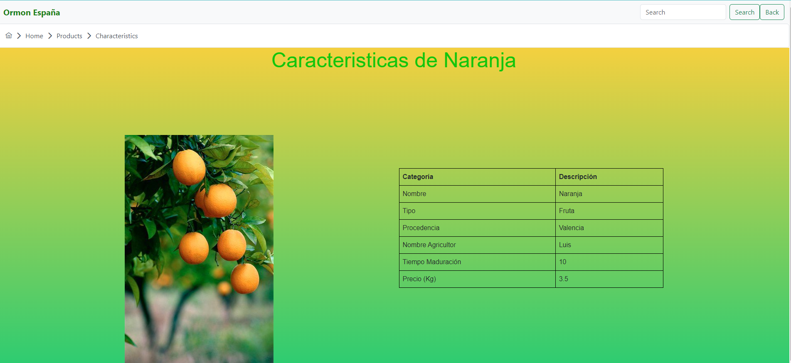

<h1 align="center">
   
  </img>
   
</h1>

# ORMON ESPAÑA

## About

This project is focused on learning and training. The purpose is to create components, communicate with each other and incorporate buttons to go forward and backward while visualizing breadcrums.
For this project, is about the creation for an ecological transport company that wants to show its products and their characteristics as well as their transport.
The application contains a home page, a menu where you can see all the products in which you can access each one individually and see its own characteristics.
You will also have a menu where you can see your fleet of trucks, your type of truck with its characteristics and its routes.
I hope you enjoy watching it as much as I have enjoyed creating it, thank you very much!

## Mockups

## Final Result

#### Home Page

#### Product Page

#### Characteristics Page

#### Footer

## Deploy

### Deployed on Vercel

### Development server

This project was generated with [Angular CLI](https://github.com/angular/angular-cli) version 15.2.3.

Run `ng serve` for a dev server. Navigate to `http://localhost:4200/`. The application will automatically reload if you change any of the source files.

### Code scaffolding

Run `ng generate component component-name` to generate a new component. You can also use `ng generate directive|pipe|service|class|guard|interface|enum|module`.

### Build

Run `ng build` to build the project. The build artifacts will be stored in the `dist/` directory.

### Running unit tests

Run `ng test` to execute the unit tests via [Karma](https://karma-runner.github.io).

### Running end-to-end tests

Run `ng e2e` to execute the end-to-end tests via a platform of your choice. To use this command, you need to first add a package that implements end-to-end testing capabilities.

### Further help

To get more help on the Angular CLI use `ng help` or go check out the [Angular CLI Overview and Command Reference](https://angular.io/cli) page.

### Time spent

| Day             | Time (h) |
| --------------- | -------- |
| ¡¡ ONLY TODAY!! | 6h       |
| Total           | 6h       |

## Author

Christian Oller Vilchez ✌️
christianoller.dev@gmail.com
